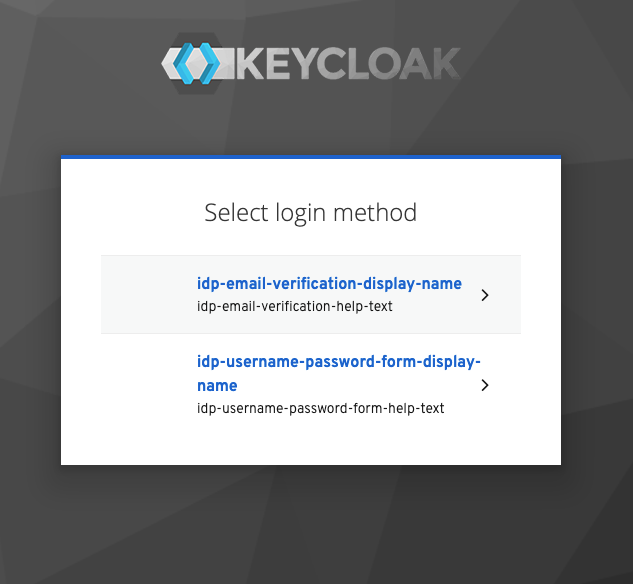

# docker-keycloak-login-selector-bug

It looks like there are some messages that are missing from keycloak that should get used by the login method selector form.

The issue presents itself when the following is true:

* You must be coming in from an Identity Provider with the same username/email of an existing keycloak account
* Keycloak is configured with an SMTP server (thus enabling multiple ways to link your existing account)
* The user selects "Try another way" when attempting to link their account

Steps to reproduce

1. Clone this repo (`git clone https://github.com/ammmze/docker-keycloak-login-selector-bug.git`)
2. Start up (`docker-compose up`)
3. Go to [Keycloak Admin Console](http://localhost:8680/auth/admin)
4. Click the sign in with "Mock Identity Provider"
5. Use the credentials `admin` / `admin@123` in the "Mock Identity Provider" login form and submit
6. Fill user details in Keycloak and submit:
    * Username: `admin`
    * Email: `admin@keycloak.local`
    * First Name: `admin`
    * Last Name: `admin`
7. Click "Add to existing account"
8. Click "Try Another Way"
9. Observe the placeholder text



I'd propose messages like:

```properties
idp-email-verification-display-name=Login with an email link
idp-email-verification-help-text=We will send an email with a link to login to your account.
idp-username-password-form-display-name=Login with your password
idp-username-password-form-help-text=Use your existing username and password to sign in.
```